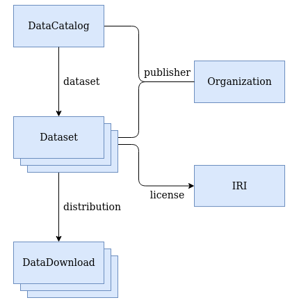

Module LinkedDataSets
=====================

This module provides assistance to use your [Omeka-S](https://omeka.org/s/) system
to *describe* and *publish* your data collections as so called  **LinkedDataSets**,
following the guidelines described in [NDE Requirements for datasets](https://netwerk-digitaal-erfgoed.github.io/requirements-datasets/).

The module adds a *LinkedDataSets* functionality to your Omeka-S system where you can create and store
descriptions of your data collections as so called *Dataset* elements and thereby make them online  *findable* and *accessible*
as Linked Data, readable for both man and machine.

The description in such a *Dataset* may contain "metadata like" information of the data collection, for example 
about its creators, licenses etc. 
Besides that, it can carry references to representations of the actual data e.g. in  datadump file,
a so called *Distribution* (a.k.a. *DataDownload*) in the guideline terminology, in a RDF format.

## The LinkedDataSets conceptual model

In the [NDE Requirements for datasets](https://netwerk-digitaal-erfgoed.github.io/requirements-datasets/).
is described how we can make descriptions of a *Dataset*, in a [*LinkedData*]() way, in the form of RDF objects.
The guidelines promotes the use of a small part of the Schema.org vocabulary for this purpose.

With this vocabulary aspects like ownership, creators, license, titles, data locations etc. are all described
using a [simple conceptual model](https://netwerk-digitaal-erfgoed.github.io/requirements-datasets/#conceptual-model).
of 4 key elements: *DataCatalog*, *Dataset*, *Distribution*(or *DataDownload*) and *Organization*.
See figure. 

### The LinkedData Sets conceptual model implemented in Omeka-S

The LinkedDataSets module translates the various parts of the LinkedDatasSet conceptual model to
Omeka-S resources (Item) with appropiate properties, so that Omeka-S can be used to create
the descriptions.

The "LD Sets conceptual model implementation." table below shows how the elements from
guideline correspond to Omeka-S resources.

| Concept in guideline | Usage | Type in guideline | LinkedDataSets implementation | Remarks |
|---|---|---|---|---|
| DataCatalog | Top element, has collection of Datasets | schema:DataCatalog | **Item** with class **schema:DataCatalog** | resource template DataCatalog |
| Dataset | Has links to some Distributions | schema:Dataset | **Item** with class **schema:Dataset** | resource template Dataset attached to a DataCatalog Item |
| Distribution | Element that references a datadump or data endpoint | schema:DataDownload | **Item** with class **schema:DataDownload** attached to a Dataset Item| resource template LDS Distribution |
| Organization | Element used to represent organization | schema:Organization | **Item** with class **schema:Organization** | resource template LDS Organization |
| Person | Element used to represent person | schema:Person | **Item** with class **schema:Person** | resource template LDS Person |

## Required modules

 - [Custom Vocab](https://github.com/omeka-s-modules/CustomVocab)
